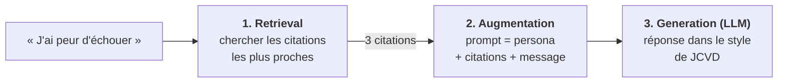
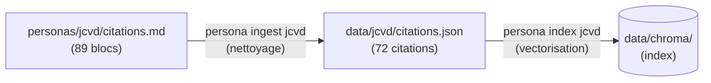
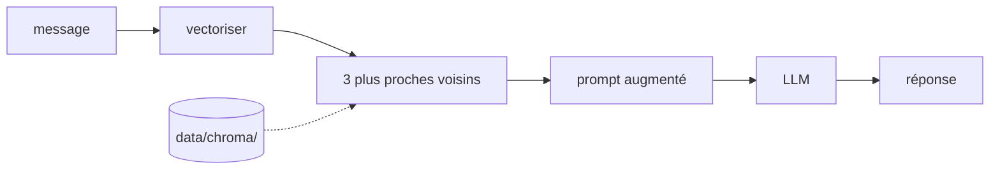
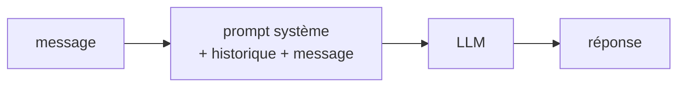

# Comprendre le RAG avec persona-bot

Ce guide s'adresse à un·e développeur·se qui n'a jamais construit de RAG. Il suppose que tu
maîtrises Python et que tu connais, au moins dans les grandes lignes, ce qu'est un LLM (un
modèle, tel que Claude, qui génère du texte). Aucune autre connaissance préalable n'est
requise.

Le fil conducteur est la persona Jean-Claude Van Damme et ses 72 citations. Le projet en compte
une autre, Godefroy de Montmirail, construite de la même façon. La section 10 montre ce qui
change pour une persona qui n'a pas de citations.

Tous les chiffres et exemples présentés ci-dessous proviennent d'exécutions réelles du code
du projet ; tu peux donc les reproduire.

---

## 1. Le problème de départ

L'objectif est de construire un bot qui s'exprime comme Jean-Claude Van Damme. Une première
approche consiste à demander simplement à Claude d'imiter JCVD. Le résultat est partiellement
satisfaisant : Claude produit une imitation générique, et l'on ne maîtrise pas ce qui relève
réellement du style de JCVD.

Une deuxième approche consiste à fournir à Claude de véritables citations en guise
d'exemples. Le résultat est meilleur, mais une question se pose : lesquelles choisir ? Si
l'utilisateur évoque l'amour, les citations consacrées à l'air ou aux cacahuètes lui sont de
peu d'utilité. Il faut donc, **pour chaque message**, sélectionner les citations qui
correspondent au sujet abordé.

C'est précisément le rôle d'un RAG.

> **Précision.** Avec 72 citations, il serait tout à fait possible de les inclure *toutes*
> dans le prompt : elles tiendraient largement dans le contexte de Claude. Le RAG devient
> indispensable lorsque la base est volumineuse (des milliers de documents, une
> documentation interne, des tickets, etc.). Ici, ce corpus restreint sert à étudier le
> mécanisme sur un exemple que tu peux lire et vérifier intégralement.

---

## 2. Le RAG en une phrase

**RAG** = *Retrieval-Augmented Generation* : avant de demander à un LLM de répondre, on
**recherche** (*retrieval*) les documents pertinents dans une base, on les **ajoute** au
prompt (*augmentation*), puis le LLM **génère** sa réponse en s'appuyant sur eux
(*generation*).



Les étapes 2 et 3 sont simples : elles se résument à construire une chaîne de caractères et
à effectuer un appel d'API. Toute la difficulté réside dans l'étape 1 : **comment identifier
les textes « proches » d'une question ?** Les deux sections suivantes traitent de cette
question.

---

## 3. Pourquoi la recherche par mots-clés ne suffit pas

L'approche naïve consiste à retenir les citations qui contiennent les mots de la question.

Pour « Comment devenir meilleur ? », une recherche sur le mot « meilleur » renvoie :

```
"Le Cycle... le cycle du cosmos dans la vie... [...] je suis le meilleur... Mais en vérité,
 il n'y a pas de meilleur !"
"Mon modèle, c'est moi-même ! Je suis mon meilleur modèle [...]"
"Ma femme n'est pas ma meilleure partenaire sexuelle, mais elle fait très bien le ménage."
```

Cette approche présente deux défauts :

- **Faux positif** : la troisième citation contient le mot recherché, mais n'a aucun
  rapport avec le sujet.
- **Faux négatif** : la citation la plus pertinente, « Ma devise, c'est : il faut se
  recréer, pour recréer ! », ne contient aucun mot de la question. Elle reste donc invisible.

Les mots ne constituent qu'un indice du sens. Il faut disposer d'un moyen de comparer **le
sens** de deux textes.

---

## 4. Les embeddings : transformer du sens en nombres

### L'intuition

Imagine une carte sur laquelle chaque phrase serait représentée par un point, et où les
phrases traitant du même sujet seraient voisines. « Comment devenir meilleur ? » se
trouverait près de « Comment progresser ? », et loin de « La bourse a chuté ».

Un **embedding** correspond à la position d'un texte sur une telle carte, à ceci près
qu'au lieu de deux coordonnées (x, y), il en compte plusieurs centaines : **384** dans ce
projet. Un modèle d'apprentissage automatique (*machine learning*), entraîné sur de très
grandes quantités de textes, a appris à placer les phrases de sens voisin à des positions
proches.

Concrètement, un embedding est une liste de nombres :

```python
>>> model.encode("Je suis aware.")
[0.245, -0.284, 0.076, 0.054, 0.083, 0.099, ...]   # 384 nombres au total
```

Pris isolément, chacun de ces nombres n'a aucune signification pour un humain. Seules les
**comparaisons** entre vecteurs ont un sens.

Le nombre de dimensions (384) n'est pas un paramètre réglable : il est déterminé par le
modèle choisi. D'autres modèles produisent des vecteurs de 768, 1024 ou 3072 dimensions.

### Comparer deux vecteurs : la similarité cosinus

Pour déterminer si deux vecteurs « pointent dans la même direction », on utilise la
**similarité cosinus** : une valeur proche de 1 indique un sens similaire, une valeur proche
de 0 l'absence de rapport. Son calcul, ainsi que les raisons pour lesquelles on la préfère à
la distance euclidienne, sont détaillés ci-après.

Scores réels obtenus avec le modèle du projet :

| Phrase A | Phrase B | Similarité |
|---|---|---|
| J'ai peur d'échouer | I'm afraid of failing | **0,971** |
| Comment devenir meilleur ? | Comment devenir plus fort ? | 0,679 |
| Comment devenir meilleur ? | Ma devise, c'est : il faut se recréer, pour recréer ! | 0,436 |
| Comment devenir meilleur ? | Si tu parles à ton eau de Javel […], elle est moins concentrée. | 0,140 |
| Le chat dort sur le canapé | La bourse a chuté de 3 % | 0,067 |

Trois enseignements s'en dégagent :

1. **C'est le sens qui compte, et non les mots.** « se recréer » est reconnu comme proche
   de « devenir meilleur », sans aucun mot en commun.
2. **Le modèle est multilingue.** Une phrase et sa traduction anglaise obtiennent des
   vecteurs presque identiques (0,97). Cette propriété est utile ici, car JCVD mêle le
   français et l'anglais.
3. **Les scores absolus dépendent du modèle.** Dans ce projet, une citation pertinente
   obtient généralement un score compris entre 0,3 et 0,6, et non de l'ordre de 0,9 (pour
   les conséquences sur le choix du seuil, voir la section 8).

### Distance euclidienne ou cosinus : quelle différence ?

Il existe deux manières courantes d'évaluer la proximité de deux vecteurs. Pour les
comprendre, laissons de côté les 384 dimensions et plaçons trois vecteurs dans un plan à
deux dimensions, tous issus de l'origine O :

```
  y
  │
  ● C = (0, 1)
  │
  │
  O────●───────────●──── x
       A = (1, 0)  B = (3, 0)
```

A et B pointent **dans la même direction** ; B est simplement trois fois plus long. C pointe
dans une direction perpendiculaire.

**La distance euclidienne** (ou distance L2) est la distance en ligne droite entre les
extrémités des deux flèches. Elle se calcule comme en géométrie élémentaire : racine carrée
de la somme des carrés des écarts, coordonnée par coordonnée.

- A ↔ B : √((3 − 1)² + (0 − 0)²) = **2**
- A ↔ C : √((0 − 1)² + (1 − 0)²) = √2 ≈ **1,41**

Selon cette mesure, A est plus proche de C que de B.

**La similarité cosinus** ne tient compte que de **l'angle** entre les deux flèches, et non
de leur longueur. Elle correspond au cosinus de cet angle : 1 lorsque les flèches pointent
dans la même direction (angle de 0°), 0 lorsqu'elles sont perpendiculaires (90°), −1
lorsqu'elles sont opposées (180°). On la calcule en divisant le produit scalaire par le
produit des longueurs.

- A ↔ B : angle de 0°, similarité **1**
- A ↔ C : angle de 90°, similarité **0**

Selon cette mesure, A et B sont équivalents, et A n'a aucun rapport avec C. La **distance
cosinus** se définit simplement comme `1 − similarité` : elle vaut 0 pour des vecteurs de
même direction, et 2 au maximum.

Tu peux vérifier ces valeurs toi-même :

```python
import numpy as np

A, B, C = np.array([1, 0]), np.array([3, 0]), np.array([0, 1])

def euclidienne(u, v):
    return np.linalg.norm(u - v)

def cosinus(u, v):
    return u @ v / (np.linalg.norm(u) * np.linalg.norm(v))

print(euclidienne(A, B), euclidienne(A, C))  # 2.0  1.414...
print(cosinus(A, B), cosinus(A, C))          # 1.0  0.0
```

**Pourquoi le cosinus convient mieux au texte.** Dans un embedding, c'est la **direction**
qui porte le sens (le sujet du texte). La **longueur** varie pour d'autres raisons (longueur
du texte, présence de mots très fréquents, etc.) sans lien avec le sujet. La distance
euclidienne combine ces deux composantes ; le cosinus ne conserve que la direction. Avec le
modèle du projet, la longueur des vecteurs de citations varie de **2,94 à 4,87** : cet écart
n'est pas négligeable.

Sur le jeu d'évaluation (voir la section 9), les mesures obtenues avec les deux distances
sont les suivantes (la ligne « Cosinus » correspond à la recherche actuelle) :

| Distance | facile hit@3 (MRR) | difficile hit@3 (MRR) |
|---|---|---|
| Cosinus (choix du projet) | 16/16 (1,00) | 11/14 (0,64) |
| Euclidienne | 16/16 (0,94) | 10/14 (0,62) |

L'écart est faible, mais il va dans le sens attendu.

**Le cas des vecteurs normalisés.** De nombreux modèles d'embeddings « normalisent » leurs
vecteurs, c'est-à-dire qu'ils les ramènent tous à une longueur de 1. Dans ce cas, les deux
distances produisent exactement le même classement, car pour des vecteurs de longueur 1, le
carré de la distance euclidienne vaut `2 − 2 × cosinus`. Le modèle du projet ne normalise
pas ses vecteurs : le choix de la distance a donc une incidence.

### Dans le projet

Le modèle retenu est `paraphrase-multilingual-MiniLM-L12-v2`, issu de la bibliothèque
sentence-transformers. Il s'exécute **en local** sur ta machine : il ne requiert ni clé
API, ni frais d'utilisation. Claude ne peut pas être utilisé pour cette étape, car
Anthropic ne propose pas d'API d'embeddings.

Il est déclaré dans `src/persona_bot/config.py` :

```python
EMBEDDING_MODEL = "paraphrase-multilingual-MiniLM-L12-v2"
```

---

## 5. La base vectorielle : retrouver les voisins rapidement

On dispose désormais d'un moyen de comparer une question à une citation. Pour obtenir les
3 citations les plus proches, il suffirait de calculer la similarité avec chacune des 72
citations, puis de trier les résultats. Avec 72 textes, l'opération est instantanée.

Une **base de données vectorielle** effectue ce travail à ta place, et le fait efficacement
même avec des millions de vecteurs, grâce à des index spécialisés. Elle stocke :

- le vecteur de chaque document ;
- le texte d'origine ;
- des métadonnées (ici : thèmes, ton, longueur).

Le projet utilise **Chroma**, qui s'exécute en local et enregistre l'ensemble de ses données
dans `data/chroma/`. Chaque persona qui a des citations y a sa propre **collection**
(l'équivalent d'une table), nommée d'après son slug : `citations_jcvd` pour JCVD.

Extrait de `src/persona_bot/index.py` :

```python
collection = client.create_collection(
    name=persona.collection_name,  # "citations_jcvd"
    embedding_function=embedding_function(),
    configuration={"hnsw": {"space": "cosine"}},
)
collection.add(ids=[...], documents=[...], metadatas=[...])
```

Deux points méritent attention :

- `embedding_function` : le modèle est confié à Chroma, qui calcule lui-même les vecteurs
  lors de l'ajout des documents **et** à chaque recherche. On garantit ainsi que documents
  et questions passent par le même modèle, condition indispensable : deux modèles différents
  placent les textes sur deux « cartes » distinctes, et la comparaison de leurs vecteurs
  n'aurait aucun sens.
- `"space": "cosine"` : par défaut, Chroma mesure une distance euclidienne, et en renvoie
  même le **carré** (pour la meilleure citation associée à « Comment devenir meilleur ? » :
  14,67, soit 3,83²). On lui demande ici la distance cosinus (voir la section 4), mieux
  adaptée au texte, ce qui rend exacte la formule `similarité = 1 − distance`. Avec la
  distance euclidienne, ce calcul produirait des valeurs négatives dépourvues de
  signification, et le seuil de 0,2 éliminerait tous les résultats.

---

## 6. Deux moments distincts : indexation et interrogation

Un RAG se décompose en deux phases qu'il convient de ne pas confondre.

**Indexation (hors ligne, une seule fois)** : on prépare la base.



Cette phase n'est relancée que si les citations changent. La vectorisation de millions de
documents peut prendre plusieurs heures : il n'est pas envisageable de la répéter à chaque
question.

**Interrogation (en ligne, à chaque message)** : on exploite la base.



La flèche en pointillés indique que la recherche des voisins lit l'index produit lors de la
phase d'indexation, sans le modifier.

---

## 7. Parcours complet d'un message dans le code

Suivons le message « J'ai peur d'échouer », envoyé à JCVD, à travers `src/persona_bot/bot.py`.

### 7.1 Retrieval — `Retriever.search()` (`retriever.py`)

```python
results = self.collection.query(query_texts=[query], n_results=k, ...)
```

Chroma vectorise la question, identifie les 3 citations les plus proches et renvoie leurs
distances. Celles-ci sont converties en similarités, puis les citations dont la similarité
est inférieure au seuil (`SIMILARITY_THRESHOLD = 0.2`) sont écartées.

### 7.2 Augmentation — `PersonaBot.respond()` (`bot.py`)

Les citations retenues sont insérées dans le message envoyé à Claude. Voici le message
utilisateur que Claude reçoit effectivement :

```
<citations>
- "Le grand combat, c'est contre soi-même. La victoire, c'est d'avoir compris ce que l'on veut... et d'y croire."
- "Me montrer nu de dos ne me pose pas de problème mais, de face, c'est une autre histoire, je ne voudrais pas perdre tout mes fans."
- "Mon modèle, c'est moi-même ! Je suis mon meilleur modèle parce que je connais mes erreurs, [...]"
</citations>

Message de l'utilisateur : J'ai peur d'échouer
```

La deuxième citation n'a guère de rapport avec l'échec : le retrieval n'est pas parfait
(voir la section 8). Cette imperfection est acceptable ici, car Claude choisit lui-même les
éléments qu'il exploite.

En complément de ce message, Claude reçoit :

- **Le prompt système** (`system_prompt` dans `personas/jcvd/persona.toml`), qui décrit la
  persona : ses thèmes, sa manière de s'exprimer, et la consigne de ne pas inventer de
  fausses citations. Il est identique à
  chaque appel ; c'est la raison pour laquelle les citations, qui varient, n'y figurent pas.

  Un exemple d'ajustement : une première version indiquait seulement que JCVD pose des
  « questions à l'interlocuteur ("Tu comprends ?") ». Le modèle en concluait qu'il devait
  terminer chaque réponse par une question, un travers fréquent chez les LLM. Le prompt
  précise désormais que JCVD n'interroge pas son interlocuteur : sa seule question est une
  vérification rhétorique (« Tu comprends ? »), facultative, et de nombreuses réponses se
  concluent par une affirmation. Il en explique également la **raison** (JCVD partage sa
  vision, il ne conduit pas un entretien) : un modèle suit mieux une consigne dont il
  comprend la justification.

  Autre écueil : les consignes contradictoires. Pour que JCVD s'exprime en longues phrases
  sinueuses, il a également fallu supprimer la fin du prompt, qui demandait « quelques
  paragraphes courts » ; le modèle aurait sinon dû arbitrer entre les deux. Cependant,
  demander « des phrases plus longues » risquait aussi d'allonger les réponses, ce qui
  n'était pas souhaité. La version actuelle fixe donc un **budget** explicite (environ 60 à
  120 mots, en un paragraphe) et précise comment le répartir : deux ou trois longues
  phrases plutôt qu'une succession de phrases courtes. Un modèle respecte bien une
  fourchette chiffrée, alors qu'il interprète librement des termes comme « court » ou
  « long ».
- **L'historique** de la conversation. L'API de Claude ne conserve aucune mémoire entre deux
  appels : pour mener une véritable conversation, il faut renvoyer l'ensemble des échanges
  précédents à chaque appel. Les messages y sont stockés *sans* les citations, afin de ne
  pas alourdir le contexte.

### 7.3 Generation — l'appel au modèle de langage

L'appel est isolé dans `src/persona_bot/llm.py`. Avec Claude :

```python
client.beta.messages.create(
    model="claude-opus-5",
    system=persona.system_prompt,
    messages=history + [{"role": "user", "content": content}],
    output_config={"effort": "low"},
    ...
)
```

Deux paramètres sont propres à Claude :

- `effort: "low"` limite la réflexion du modèle avant sa réponse : pour une conversation,
  l'appel est ainsi plus rapide et moins coûteux, sans perte de qualité notable ;
- `fallbacks="default"` (dans le code complet) permet à l'API de basculer sur un autre
  modèle si Claude refuse une requête pour des raisons de sécurité.

**Le modèle de langage est interchangeable.** Aucune des étapes précédentes (ingestion,
embeddings, recherche) n'en dépend : les citations sont trouvées de la même manière, puis
transmises à tout modèle capable de suivre un prompt. Avec `LLM_BACKEND=ollama`, le même
code appelle un modèle open source exécuté sur ta machine. Cette solution est gratuite et
les messages ne quittent pas ta machine, mais un petit modèle suit nettement moins
fidèlement le prompt (voir les [mesures dans le README](../README.md#choisir-le-modèle-de-langage--claude-ou-ollama)).
En d'autres termes, le RAG apporte les **connaissances** (les citations), et le modèle de
langage la **qualité rédactionnelle**.

---

## 8. Limites et pièges

Ces points ne relèvent pas de la théorie : chacun d'eux s'est présenté lors de la
construction du projet.

**Le retrieval ramène parfois des textes hors sujet**, comme la citation sur la nudité
observée en 7.2. Plusieurs causes y contribuent : un modèle d'embeddings de petite taille,
un corpus de 72 textes très courts, et une question qui ne ressemble à aucune citation.
Pistes d'amélioration : un modèle plus performant, un seuil plus strict, ou une combinaison
avec une recherche par mots-clés (« recherche hybride »).

**Un seuil de similarité dépend du modèle.** Une première version du projet utilisait un
seuil de 0,65 : avec ce modèle, il aurait éliminé toutes les citations.

**Vérifie que tes embeddings sont de véritables embeddings.** Une première version
« simulait » les embeddings au moyen d'un hachage du texte (SHA-256). Le code s'exécutait
sans erreur, mais la recherche renvoyait des citations aléatoires : un hachage ne porte
aucune information de sens. Enseignement : teste toujours le retrieval isolément
(`uv run persona search jcvd "..."`) avant de le relier au LLM. Si les résultats ne sont pas
cohérents, le LLM ne pourra pas compenser ce défaut.

**La qualité des données compte autant que le modèle.** Le fichier source contenait 17
doublons ou quasi-doublons. Sans nettoyage, une même citation aurait pu apparaître deux fois
et occuper deux des trois places disponibles. Le parser les élimine en comparant des textes
normalisés (sans accents ni ponctuation) et en fusionnant les versions similaires à plus de
90 %.

**Les métadonnées par mots-clés restent approximatives.** Les champs `themes` et `tone`
sont calculés à l'aide de règles simples. Ils ne servent pas à la recherche, mais
pourraient servir au filtrage (voir l'exercice 4).

---

## 9. Mesurer avant d'améliorer

Comment savoir si une modification améliore la recherche ? Tester trois questions « à
l'œil » ne suffit pas : on a tendance à retenir les exemples favorables. Il faut une
**évaluation** : des questions fixées à l'avance, la réponse attendue pour chacune, et un
score.

### Le jeu d'évaluation

`personas/jcvd/eval_search.json` contient 30 questions. Pour chacune d'elles sont listées les
citations qui y répondent, identifiées par un fragment de leur texte (un identifiant tel que
`quote_035` change dès que le fichier source est modifié). `uv run persona eval jcvd` calcule deux
indicateurs :

- **hit@3** : la bonne citation figure-t-elle parmi les 3 que le bot reçoit effectivement ?
- **MRR** (*Mean Reciprocal Rank*, rang réciproque moyen) : 1 si la bonne citation est
  classée 1re, 0,5 si elle est 2e, 0,33 si elle est 3e, etc., et 0 si elle ne figure pas
  dans les 10 premiers résultats. Cet indicateur récompense une citation bien classée.

### Premier piège : une évaluation trop facile

La première version du jeu ne comportait que des questions reprenant des mots des citations
(« Est-ce que tu as déjà pris de la drogue ? » pour « La drogue, faut pas toucher… »).
Résultat : 16/16, toujours au rang 1. Ce score parfait ne démontrait rien : rédigées par
une personne qui connaissait les citations, ces questions étaient trop faciles.

Le jeu a donc été complété par 14 questions **indirectes**, formulées comme le ferait un
véritable utilisateur (« Tu crois aux horoscopes ? » pour la citation sur la voyante). Les
questions sont étiquetées `facile` ou `difficile`. Les scores de la recherche actuelle
figurent dans la ligne « Référence » du tableau ci-dessous.

### Une expérience : enrichir les citations

Hypothèse testée : une question et une citation ne se ressemblent pas, même lorsque l'une
répond à l'autre. On a donc demandé à un LLM (`ministral-3:3b`, via Ollama) de générer, pour
chaque citation, 3 questions auxquelles elle répondrait, afin de les indexer avec elle. Deux
variantes ont été évaluées :

- **A** : un vecteur par citation, calculé sur « citation + ses questions » ;
- **B** : un vecteur pour la citation et un par question, tous rattachés à la citation.

| Variante | facile hit@3 (MRR) | difficile hit@3 (MRR) |
|---|---|---|
| Référence (citations seules) | 16/16 (1,00) | 11/14 (0,64) |
| A | 15/16 (0,91) | 11/14 (0,77) |
| B | 16/16 (0,97) | 10/14 (0,54) |

Aucune variante ne se révèle nettement supérieure, et **l'enrichissement n'a pas été
intégré**. La variante A classe mieux les bonnes citations sur les questions difficiles,
mais n'en retrouve aucune supplémentaire, et elle fait échouer « Quel est ton film
préféré ? » (rang 1 → hors des 10 premiers). Les questions générées pour d'autres citations
évoquent des « films » et attirent cette requête, tandis que « Forrest Gump » se trouve
dilué dans un texte plus long : le texte ajouté apporte du signal, mais également du bruit.

Enseignements à retenir :

- **Mesure avant et après.** Sans évaluation, cette idée séduisante aurait été intégrée et
  aurait dégradé certaines réponses sans que personne ne s'en aperçoive.
- **Un petit jeu d'évaluation est bruité** : avec 14 questions difficiles, chaque question
  représente 7 points. Ne tire pas de conclusion d'un écart d'une ou deux questions.
- **N'ajuste pas ta méthode en observant le jeu d'évaluation** (par exemple en réécrivant
  la consigne de génération jusqu'à faire réussir « horoscopes ») : le score augmenterait
  sans que la recherche soit meilleure pour de véritables questions.
- **Un petit LLM respecte mal les consignes de format** : ici, il numérotait ses questions
  et les mettait en italique malgré la consigne, ce qui a imposé un découpage tolérant.

## 10. Une persona sans citations : quand le RAG n'est pas là

Toutes les personas n'ont pas de citations. Pour un personnage inventé, ou pour quelqu'un
dont on n'a pas rassemblé les paroles, il n'y a rien à chercher. Le projet gère ce cas : une
persona sans fichier `citations.md` saute les étapes 1 et 2 du RAG (retrieval et
augmentation). `PersonaBot` n'a alors pas de `Retriever`, et le message de l'utilisateur part
tel quel au modèle, avec le prompt système et l'historique. Ce n'est plus du RAG : c'est un
modèle de langage à qui on a donné un rôle.



Conséquence pratique : pour cette persona, ni Chroma ni le modèle d'embeddings ne sont
chargés, et `persona ingest`, `index`, `search` et `eval` n'ont rien à faire (ils le disent).

### Ce que les citations apportent : une mesure

Même question posée à JCVD avec Claude, une fois normalement, une fois avec la recherche
désactivée (même prompt système, aucune citation ajoutée). Réponses réelles :

> **Question** : « Que penses-tu de l'argent ? »
>
> **Avec RAG** (citations trouvées : « Il ne faut pas avoir peur de la réussite. Si on devient
> riche, on peut devenir généreux… » à 0,444, « Au plus qu'on donne, au plus qu'on reçoit… »
> à 0,351, et une troisième sur la monnaie unique à 0,314) : « L'argent, moi je dis qu'il ne
> faut pas avoir peur de ça, […] si tu le fais circuler, si tu donnes, tu reçois encore plus,
> c'est mathématique, c'est cosmique presque. […] le bonheur il n'était pas dans la piscine,
> il était dans le fait de pouvoir aider ma famille, tu vois ? »
>
> **Sans RAG** : « L'argent, c'est comme l'eau, tu vois, ça doit couler, parce que si tu la
> gardes dans un seau fermé elle devient verte, […] l'argent il attire des gens autour de toi
> qui sourient pas pour toi mais pour le wallet, tu comprends ? »

Les deux réponses sonnent juste : Claude connaît Jean-Claude Van Damme et le prompt
système décrit précisément sa façon de parler. La différence est ailleurs. Avec le RAG, la
réponse reprend deux idées que JCVD a **réellement** exprimées (ne pas avoir peur de la
réussite, donner pour recevoir). Sans RAG, l'idée de l'eau qui croupit est plausible, mais
inventée. Côté coût, les trois citations ont ajouté environ 150 tokens à la requête (1 420
tokens lus avec, 1 268 sans).

Une seule question ne prouve rien de général (voir la section 9 sur le bruit des petites
mesures). Elle illustre le compromis :

| | Avec citations (RAG) | Sans citations |
|---|---|---|
| Ce qui guide le modèle | Le prompt système **et** de vraies paroles, choisies à chaque message | Le prompt système seul |
| Fidélité | Les idées viennent du personnage réel | Les idées sont plausibles, mais inventées par le modèle |
| Travail à fournir | Rassembler, nettoyer, indexer et évaluer un corpus | Écrire un bon prompt système |
| Dépend de ce que le modèle sait déjà | Peu : les citations apportent la matière | Beaucoup : un personnage peu connu ou inventé ne repose que sur le prompt |

Pour un personnage inventé, le choix est vite fait : il n'existe pas de « vraies paroles ».
Tout repose alors sur le prompt système, qui doit décrire la personnalité, la façon de parler
et le format attendu aussi précisément que celui de JCVD (voir la section 7.2 sur les
consignes qui se contredisent ou que le modèle interprète librement).

**Piège : un prompt qui parle de citations absentes.** Le prompt de JCVD annonce au modèle
des citations entre balises `<citations>`. Pour une persona sans citations, ne recopie pas
ce paragraphe : le modèle attendrait des balises qui n'arrivent jamais. La mesure ci-dessus
garde volontairement le prompt de JCVD intact pour ne changer qu'une seule chose, la
présence des citations.

## 11. Exercices

Chaque exercice se réalise en quelques minutes et illustre un point précis.

1. **Explorer le retrieval.** Pose tes propres questions avec
   `uv run persona search jcvd "ta question"` (ajoute `-k 10` pour afficher davantage de résultats).
   Trouve une question pour laquelle les résultats sont mauvais, et tente d'en expliquer la
   raison.

2. **Faire varier `k`.** Dans `src/persona_bot/config.py`, fixe `RETRIEVE_K` à 1, puis à 10,
   et converse avec le bot. Avec 1, les réponses s'appuient-elles davantage sur une
   citation ? Avec 10, sont-elles plus variées ou plus floues ?

3. **Désactiver le retrieval.** Renomme temporairement `personas/jcvd/citations.md` (en
   `citations.md.off` par exemple) : JCVD devient une persona sans citations. Pose les mêmes
   questions avec `uv run --env-file .env persona ask jcvd "..."` avant et après. La
   différence constitue l'apport concret du RAG (un exemple dans la section 10). Rends son
   nom au fichier ensuite.

4. **Filtrer par métadonnées.** Dans `src/persona_bot/retriever.py`, ajoute
   `where={"tone": "questionnant"}` à l'appel `collection.query(...)`. Seules les citations
   de ce ton seront alors candidates.

5. **Changer de modèle d'embeddings.** Note le score de `uv run persona eval jcvd`, remplace
   `EMBEDDING_MODEL` par `all-MiniLM-L6-v2` (un modèle entraîné principalement sur de
   l'anglais), relance `persona index jcvd` puis `persona eval jcvd`. Dans quelle mesure le
   score baisse-t-il sur les questions en français ? Rétablis ensuite le modèle d'origine et
   relance `persona index jcvd`. Pour aller plus loin, essaie un modèle plus performant (par exemple
   via l'API Voyage AI) : le score progresse-t-il ?

6. **Comparer deux modèles de langage.** Pose les mêmes questions avec
   `uv run persona ask jcvd "..."`, une fois avec Claude, une fois avec `LLM_BACKEND=ollama`.
   Compare les mesures affichées (mots, phrases, question finale) ainsi que le style.
   Quelles consignes du prompt le petit modèle respecte-t-il, et lesquelles ignore-t-il ?

7. **Créer une persona.** Ajoute un dossier dans `personas/` en suivant le
   [README](../README.md#les-personas) : d'abord sans citations, puis, si tu trouves de
   vraies paroles de ton personnage, avec un `citations.md`. Le code reste inchangé.

---

## 12. Glossaire

- **Persona** : personnage incarné par le modèle de langage, décrit par un dossier de
  `personas/` (prompt système, messages, citations facultatives).
- **LLM** (*Large Language Model*) : modèle qui génère du texte, ici Claude ou un modèle
  open source exécuté par Ollama.
- **RAG** (*Retrieval-Augmented Generation*) : technique consistant à rechercher des
  documents pertinents, puis à les fournir au LLM avant qu'il ne réponde.
- **Embedding** : liste de nombres qui représente le sens d'un texte.
- **Dimension** : nombre de valeurs d'un embedding (384 ici), fixé par le modèle.
- **Similarité cosinus** : cosinus de l'angle entre deux vecteurs ; vaut 1 pour une même
  direction (même sens) et 0 pour des directions sans rapport. Elle ne dépend pas de la
  longueur des vecteurs.
- **Distance cosinus** : `1 − similarité cosinus` ; vaut 0 pour des vecteurs de même
  direction.
- **Distance euclidienne (L2)** : distance en ligne droite entre les extrémités de deux
  vecteurs ; elle tient compte à la fois de leur direction et de leur longueur.
- **Vecteur normalisé** : vecteur ramené à une longueur de 1. Entre vecteurs normalisés,
  distance euclidienne et similarité cosinus produisent le même classement.
- **Base vectorielle** : base de données qui stocke des embeddings et retrouve ceux qui
  sont les plus proches d'un vecteur donné (ici Chroma).
- **Indexation** : phase préalable au cours de laquelle les documents sont vectorisés et
  stockés.
- **Jeu d'évaluation** : ensemble de questions fixées à l'avance, accompagnées de leur
  réponse attendue, qui permet de mesurer la qualité de la recherche (`persona eval`).
- **hit@3, MRR** : indicateurs de qualité de la recherche (présence de la bonne citation
  parmi les 3 premières ; rang réciproque moyen de la bonne citation).
- **Retrieval** : phase de recherche des documents proches d'une question.
- **Prompt système** : instructions permanentes fournies au LLM (ici, la description de la
  persona).
- **Contexte** : ensemble des éléments que le LLM reçoit lors d'un appel (prompt système,
  historique, citations).
